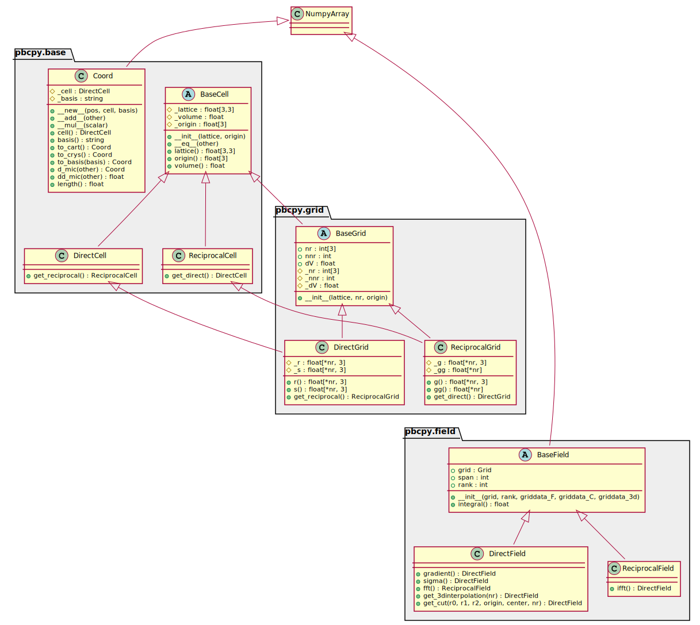

# PbcPy - Class Diagram

```plantuml
@startuml

class NumpyArray{

}

package "pbcpy.base" #EEEEEE {

Abstract BaseCell{
  + __init__(lattice, origin)
  + __eq__(other)
  + lattice() : float[3,3]
  + origin() : float[3]
  + volume() : float
  # _lattice : float[3,3]
  # _volume : float
  # _origin : float[3]
}

Class DirectCell{
  + get_reciprocal() : ReciprocalCell
}

Class ReciprocalCell{
  + get_direct() : DirectCell
}

Class Coord{
  + __new__(pos, cell, basis)
  + __add__(other)
  + __mul__(scalar)
  + cell() : DirectCell
  + basis() : string
  + to_cart() : Coord
  + to_crys() : Coord
  + to_basis(basis) : Coord
  + d_mic(other) : Coord
  + dd_mic(other) : float
  + length() : float
  # _cell : DirectCell
  # _basis : string
}

}


package "pbcpy.grid" #EEEEEE {

Abstract BaseGrid{
  + __init__(lattice, nr, origin)
  + nr : int[3]
  + nnr : int
  + dV : float
  # _nr : int[3]
  # _nnr : int
  # _dV : float
}

Class DirectGrid{
  # _r : float[*nr, 3]
  # _s : float[*nr, 3]
  + r() : float[*nr, 3]
  + s() : float[*nr, 3]
  + get_reciprocal() : ReciprocalGrid
}

Class ReciprocalGrid{
  # _g : float[*nr, 3]
  # _gg : float[*nr]
  + g() : float[*nr, 3]
  + gg() : float[*nr]
  + get_direct() : DirectGrid
}

}


package "pbcpy.field" #EEEEEE {

Abstract BaseField{
  + __init__(grid, rank, griddata_F, griddata_C, griddata_3d)
  + grid : Grid
  + span : int
  + rank : int
  + integral() : float
}

Class DirectField{
  + gradient() : DirectField
  + sigma() : DirectField
  + fft() : ReciprocalField
  + get_3dinterpolation(nr) : DirectField
  + get_cut(r0, r1, r2, origin, center, nr) : DirectField
}

Class ReciprocalField{
  + ifft() : DirectField
}

}

BaseCell <|-- DirectCell
BaseCell <|-- ReciprocalCell

NumpyArray <|-- Coord

BaseCell <|-- BaseGrid
BaseGrid <|-- DirectGrid
BaseGrid <|-- ReciprocalGrid

DirectCell <|-- DirectGrid
ReciprocalCell <|-- ReciprocalGrid

NumpyArray <|----- BaseField

BaseField <|-- DirectField
BaseField <|-- ReciprocalField

@enduml
```

